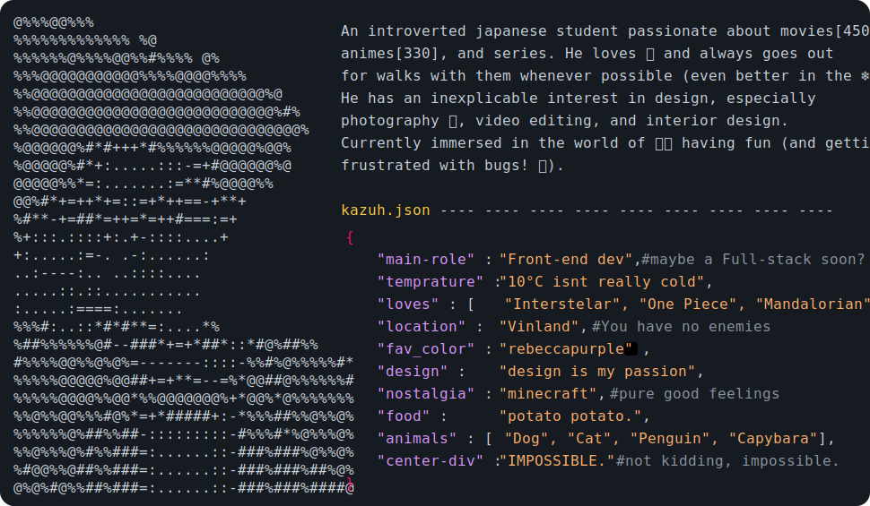

<!--
    Profile README inspired by:
      > Andrew6rant         : https://github.com/Andrew6rant/Andrew6rant
      > pvhuwung            : https://github.com/pvhuwung/pvhuwung
      > TryKatChup          : https://github.com/TryKatChup/TryKatChup
      > AnOrdinaryUsername  : https://github.com/AnOrdinaryUsername/AnOrdinaryUsername
      > ValentineFernandes  : https://github.com/ValentineFernandes/ValentineFernandes
      > thesanjithkumar     : https://github.com/thesanjithkumar/thesanjithkumar
-->


<!-- Badges -->
<div align="left">
  
  
  
  
  
</div>


<!-- ASCII ART -->
<a href="https://github.com/LucasKazuhiro/LucasKazuhiro">
  <picture>
    
  </picture>
</a>


<!--  Music  ⸜(｡˃ ᵕ ˂ )⸝♡  -->
<div>
  
  <details align="left">
    <summary>🧡</summary>
    <br>
    <div align="center">
    <video src="https://github.com/user-attachments/assets/21da40dd-e63a-48a3-9bb3-a10f1cf3c995" controls muted="true"></video>
    </div>
  </details>
</div>


<br><br>


<!-- Section Title -->
<div id="toc">
  <ul align="center" style="list-style: none">
    <summary>
      <h1>
        🤓 My Technical Skills
      </h1>
    </summary>
  </ul>
</div>


<!-- Profile stats with TV & Dithering effect -->
<!--  -->


<!-- Table Icons -->
<table>
  <tr>
    <th width="200px">
      <div id="toc">
        <ul align="center" style="list-style: none">
          <summary>
            <h2>
              Techs
            </h2>
          </summary>
        </ul>
      </div>
    </th>
    <!-- Language icons -->
    <td width="650px">
      <a href="#"></a>
      <a href="#"></a>
      <a href="https://www.typescriptlang.org/"></a>
      <a href="#"></a>
      <a href="https://www.java.com/"></a>
      <a href="https://www.python.org/"></a>
      <a href="#"></a>
      <a href="https://www.php.net/"></a>
    </td>
  </tr>

  <tr>
    <th>
      <div id="toc">
        <ul align="center" style="list-style: none">
          <summary>
            <h2>
              Frameworks<br>Libs
            </h2>
          </summary>
        </ul>
      </div>
    </th>
    <!-- Frameworks & Libs icons -->
    <td>
      <a href="https://angular.dev/"></a>
      <a href="https://spring.io/"></a>
      <a href="https://pandas.pydata.org/"></a>
      <a href="https://plotly.com/"></a>
    </td>
  </tr>

  <tr>
    <th>
      <div id="toc">
        <ul align="center" style="list-style: none">
          <summary>
            <h2>
              Tools
            </h2>
          </summary>
        </ul>
      </div>
    </th>
    <!-- Tools icons -->
    <td>
      <a href="https://code.visualstudio.com/"></a>
      <a href="https://www.jetbrains.com/pycharm/"></a>
      <a href="https://www.jetbrains.com/idea/"></a>
      <a href="https://www.figma.com/"></a>
      <a href="https://github.com/"></a>
      <a href="https://git-scm.com/"></a>
      <a href="https://www.mysql.com/"></a>
      <a href="https://www.postman.com/"></a>
      <a href="https://www.docker.com/"></a>
    </td>
  </tr>
</table>


<!-- Most used languages & Image -->
<div align="center">
  
  
  <p></p>
<div>


<br><br>


<!-- Section Title -->
<div id="toc">
  <ul align="center" style="list-style: none">
    <summary>
      <h1>
        💻 Programming Statistics
      </h1>
    </summary>
  </ul>
</div>


<div align="center">

<!--START_SECTION:commit-day-moment-->
**🕒 I'm An Afternoon Warrior 🥷🏻**

```text
🌅 Morning                240 commits         █████░░░░░░░░░░░░░░░░░░░░   18.20%
🌞 Daytime                510 commits         ██████████░░░░░░░░░░░░░░░   38.67%
🌆 Evening                260 commits         █████░░░░░░░░░░░░░░░░░░░░   19.71%
🌙 Night                  309 commits         ██████░░░░░░░░░░░░░░░░░░░   23.43%
```


<!--END_SECTION:commit-day-moment-->


<!--START_SECTION:langTime-->

```rust
From: 27 October 2024 - To: 17 December 2024

Total Time: 128 hrs 30 mins

Java              32 hrs 21 mins  ⣿⣿⣿⣿⣿⣿⣤⣀⣀⣀⣀⣀⣀⣀⣀⣀⣀⣀⣀⣀⣀⣀⣀⣀⣀   25.08 %
Python            27 hrs 13 mins  ⣿⣿⣿⣿⣿⣤⣀⣀⣀⣀⣀⣀⣀⣀⣀⣀⣀⣀⣀⣀⣀⣀⣀⣀⣀   21.10 %
TypeScript        21 hrs          ⣿⣿⣿⣿⣀⣀⣀⣀⣀⣀⣀⣀⣀⣀⣀⣀⣀⣀⣀⣀⣀⣀⣀⣀⣀   16.28 %
Markdown          11 hrs 28 mins  ⣿⣿⣄⣀⣀⣀⣀⣀⣀⣀⣀⣀⣀⣀⣀⣀⣀⣀⣀⣀⣀⣀⣀⣀⣀   08.90 %
HTML              6 hrs 19 mins   ⣿⣄⣀⣀⣀⣀⣀⣀⣀⣀⣀⣀⣀⣀⣀⣀⣀⣀⣀⣀⣀⣀⣀⣀⣀   04.90 %
JavaScript        4 hrs 28 mins   ⣷⣀⣀⣀⣀⣀⣀⣀⣀⣀⣀⣀⣀⣀⣀⣀⣀⣀⣀⣀⣀⣀⣀⣀⣀   03.47 %
CSS               4 hrs 18 mins   ⣷⣀⣀⣀⣀⣀⣀⣀⣀⣀⣀⣀⣀⣀⣀⣀⣀⣀⣀⣀⣀⣀⣀⣀⣀   03.34 %
Text              22 mins         ⣀⣀⣀⣀⣀⣀⣀⣀⣀⣀⣀⣀⣀⣀⣀⣀⣀⣀⣀⣀⣀⣀⣀⣀⣀   00.30 %
```

<!--END_SECTION:langTime-->


<!--START_SECTION:commit-dayweek-->
<!--END_SECTION:commit-dayweek-->

<!--START_SECTION:editor-time-->
<!--END_SECTION:editor-time-->


<!-- Leetcode & Streak  -->
<div align="center">
  
  
</div>

</div>


<br><br><br>


<!-- Section title -->
<div id="toc">
  <ul align="center" style="list-style: none">
    <summary>
      <h1>
        📁 Some of my Projects
      </h1>
  </summary>
  </ul>
</div>


<!-- Projects warning text -->
<div align="center">
<p>
    <b><i>Click on the image</i></b> to access the project site (if available). GitHub's hosting service<br>
    works with static websites, so various features <b><i>will not be present</i></b>, especially backend parts.<br>
    To access the <b><i>complete project</i></b>, click on the card (below the image) and <b><i>clone the repository</i></b>.
</p>
</div>


<!-- Projects subtitle (Codes) -->
<div id="toc">
  <ul align="left" style="list-style: none">
    <summary>
      <h2>🤖 Codes</h2>
  </summary>
  </ul>
</div>
<!-- First row -->
<table>
  <tr>
    <td width="50%">
      <a href="https://lucaskazuhiro.github.io/EarthWise-website-host/">
        
      </a>
      <a href="https://github.com/LucasKazuhiro/EarthWise-website">
        
      </a>
    </td>
    <td width="50%">
      <a href="https://github.com/LucasKazuhiro/loja-vinho">
        
      </a>
      <a href="https://github.com/LucasKazuhiro/loja-vinho">
        
      </a>
    </td>
  </tr>
</table>

<!-- Second row -->
<table>
  <tr>
    <td width="50%">
      <a href="https://github.com/LucasKazuhiro/anime-statistics-charts">
        
      </a>
      <a href="https://github.com/LucasKazuhiro/anime-statistics-charts">
        
      </a>
    </td>
    <td width="50%">
      <a href="https://github.com/LucasKazuhiro/filmes-statistics-charts">
        
      </a>
      <a href="https://github.com/LucasKazuhiro/filmes-statistics-charts">
        
      </a>
    </td>
  </tr>
</table>


<br>


<!-- Projects subtitle (Design) -->
<div id="toc">
  <ul align="left" style="list-style: none">
    <summary>
      <h2>✨ Design</h2>
    </summary>
  </ul>
</div>
<!-- First row -->
<table>
  <tr>
    <td width="50%">
      <a href="https://github.com/LucasKazuhiro/wine-store-dsgn">
        
      </a>
      <a href="https://github.com/LucasKazuhiro/wine-store-dsgn">
        
      </a>
    </td>
    <td width="50%">
    </td>
  </tr>
</table>


<br>


<!-- Projects subtitle (Learnings) -->
<div id="toc">
  <ul align="left" style="list-style: none">
    <summary>
      <h2>🚀 Learnings (experimental stuff)</h2>
    </summary>
  </ul>
</div>
<!-- First row -->
<table>
  <tr>
    <td width="50%">
      <a href="https://github.com/LucasKazuhiro/Java_Console_Game">
        
      </a>
    </td>
    <td width="50%">
      <a href="https://github.com/LucasKazuhiro/simple-crud-springboot-postman">
        
      </a>
    </td>
  </tr>
</table>

<!-- Second row -->
<table>
  <tr>
    <td width="50%">
      <a href="https://github.com/LucasKazuhiro/vestibular-extrair-questoes">
        
      </a>
    </td>
    <td width="50%">
      <a href="https://github.com/LucasKazuhiro/study-simple-wishlist">
        
      </a>
    </td>
  </tr>
</table>


<br><br><br><br>


<!-- Section title -->
<div id="toc">
  <ul align="center" style="list-style: none">
    <summary>
      <h1>
        🔥 Thanks for visiting
      </h1>
    </summary>
  </ul>
</div>


<!-- Gif final page -->
<a href="https://myanimelist.net/anime/269/Bleach">
  
</a>


<!-- some random Gif's quote -->
<div align="center">

```diff
@@                                      Yokoso watashi no Soul Societyie                                     @@
##                                       ようこそ、私のソウルソサエティへ                                       ##
```

</div>
